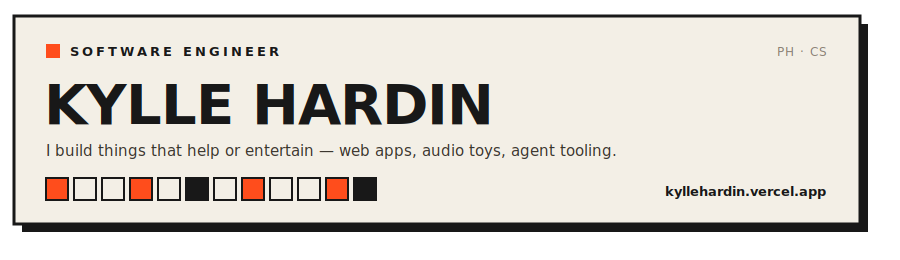

<a href="https://kyllehardin.vercel.app">
  
</a>

I'm a software engineer who likes building things that genuinely **help or entertain** —
polished web apps, playful browser audio toys, and the tooling that lets me ship them faster.
I care about clean architecture, opinionated design, and automating the boring parts.

```
now      → THUMP, a browser groovebox  ·  refining my portfolio
exploring→ AI agent orchestration  ·  Cloudflare Workers
ask me   → React, TypeScript, building audio in the browser
```

### Stack


### Reach me

<a href="mailto:mariushardin@gmail.com"></a>
<a href="https://www.linkedin.com/in/kylle-hardin/"></a>
<a href="https://kyllehardin.vercel.app"></a>

---

<sub>Fun fact: HBO devotee. Currently rewatching GOT — and yes, season 8 isn't *that* bad. Bran's my favorite; I too enjoy sitting and doing nothing.</sub>
